## New New World

    

# Objective

Discover which environmental properties are prime for Sauvignon Blanc grape cultivation and develop a web application for users to interact with and gather relevant data on a specified location.

# Background

Sauvignon blanc is a green-skinned grape variety that originates from the Bordeaux region of France. The grape most likely gets its name from the French words sauvage ("wild") and blanc ("white") due to its early origins as an indigenous grape in South West France.

Sauvignon blanc is currently widely cultivated in France, Chile, Canada, Australia, New Zealand, South Africa, the states of Washington and California in the US. It can develop desirable flavors in both cool and warm environments. Such as, flavors of grass, green bell peppers, tropical fruit, and floral notes It buds early, grows quickly, and can produce several harvest within the same year.

_SB has a Short fermentation cycle, that’s why we are only reviewing 2016 data_

#### Why Sauvignon Blanc (SB)?
According to _Wine Economist_, Sauvignon Blanc is one of the most popular and most profitable wines in the world

### Questions this application will try to answer:
+ What are the various geographical locations in which SB currently thrives?
+ What are the soil properties at those regions?
+ What are the climate conditions for those locations over the span of 2016?
+ Providing a location input, what are the soil and climate properties at that site?

---

---

## Step 1 - Data Gathering

Data was collected from these 2 APIs

<a href="https://rest.soilgrids.org/">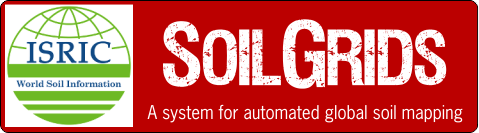</a> 

and scraped from:

## Step 2 - Data Analysis

## Step 3 - Application Build

---

---

## Sample Page

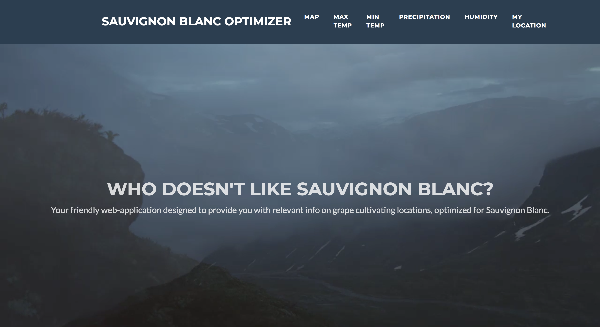
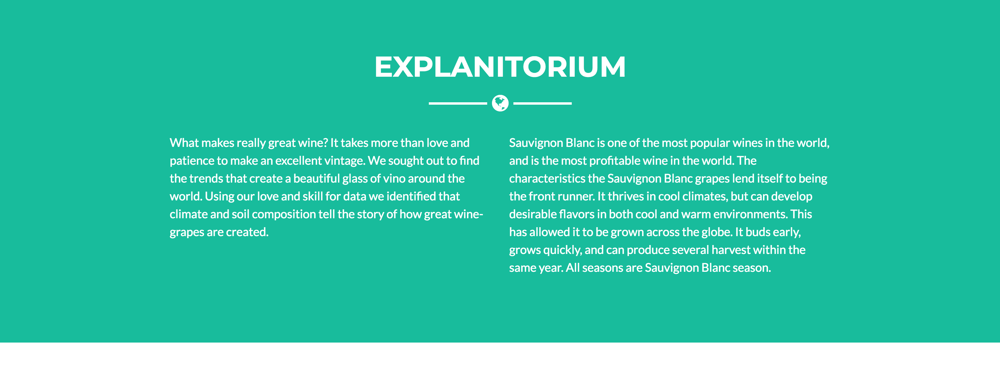
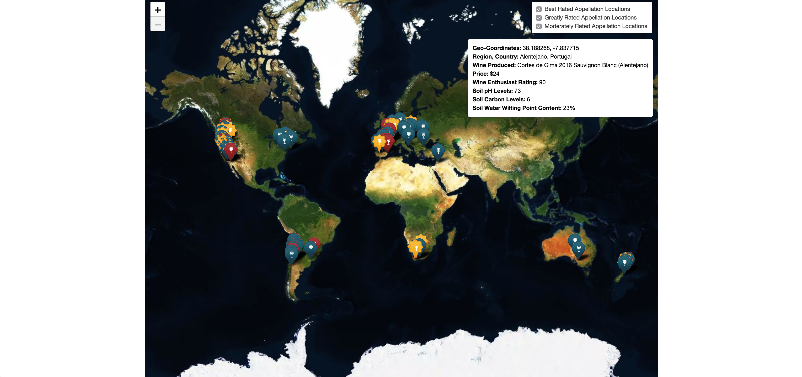
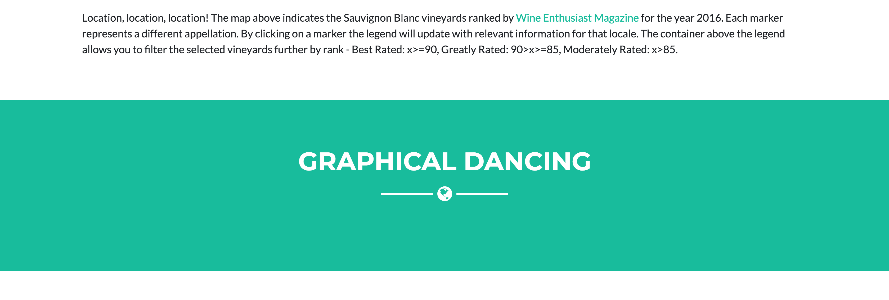
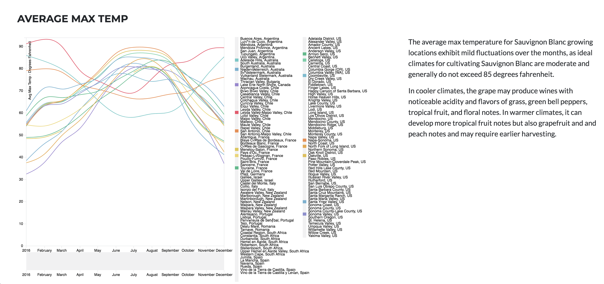
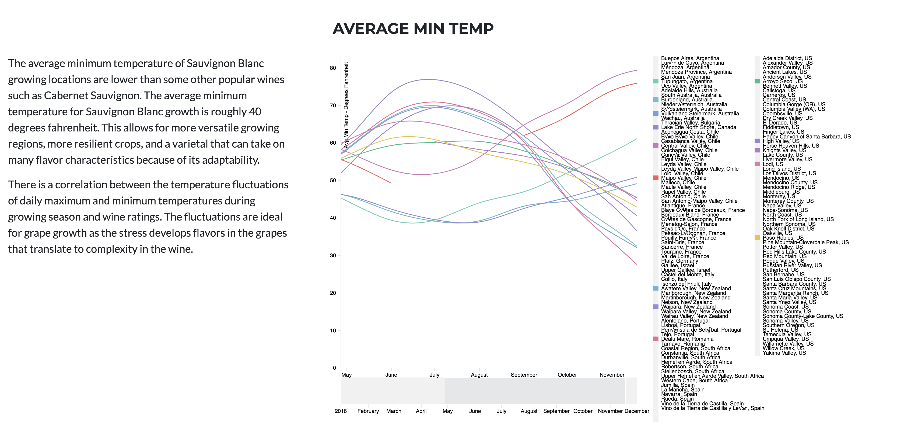
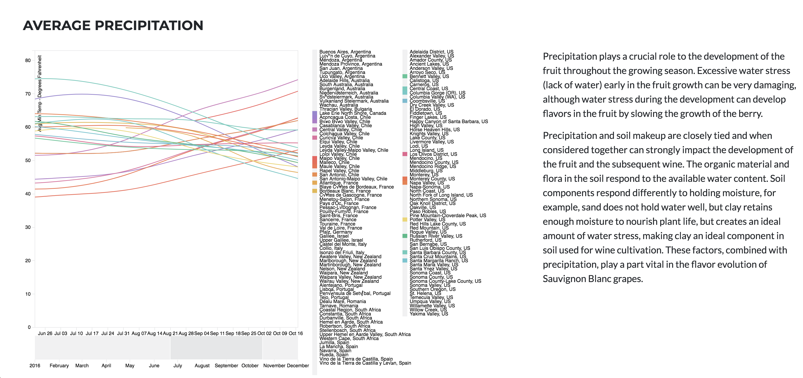
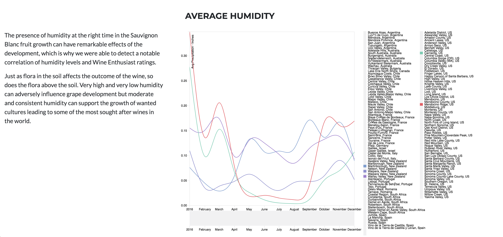

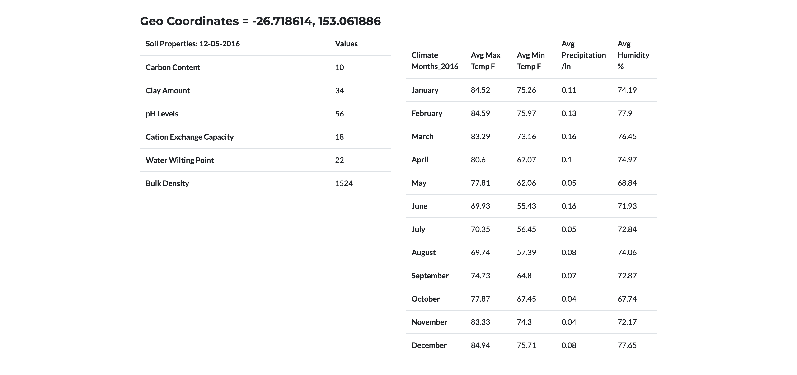
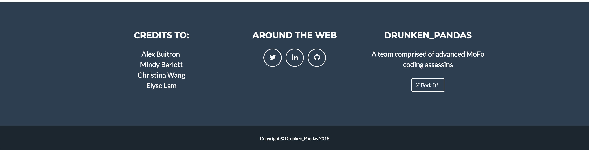

# Live Heroku Web-application
## Click [HERE](https://sauvignon-blanc-opt.herokuapp.com/) to play!

